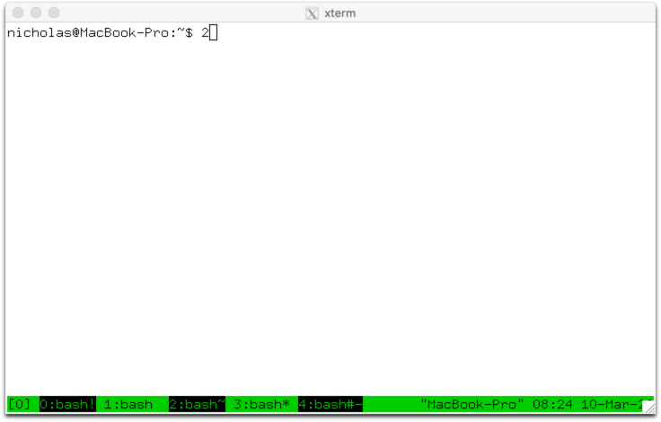
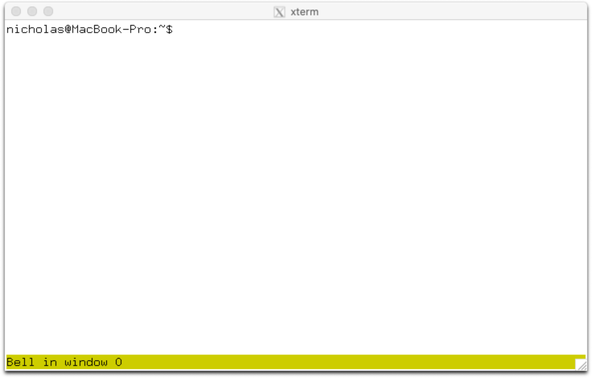
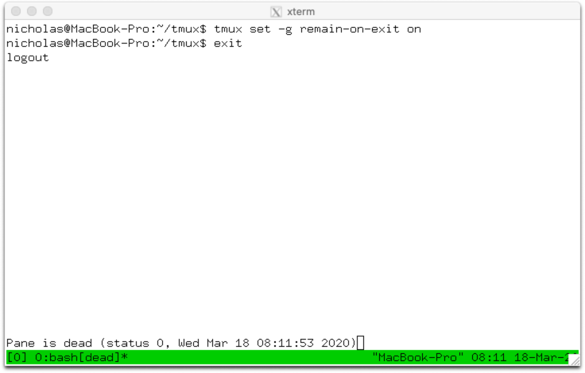
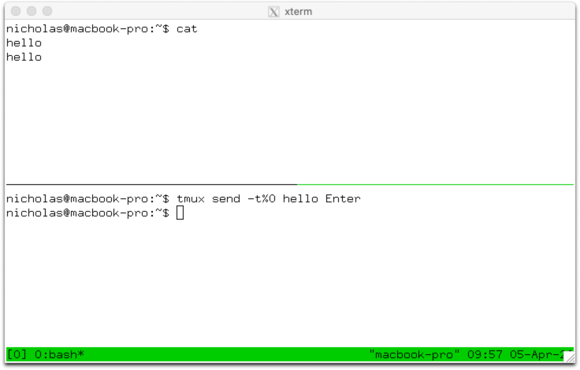
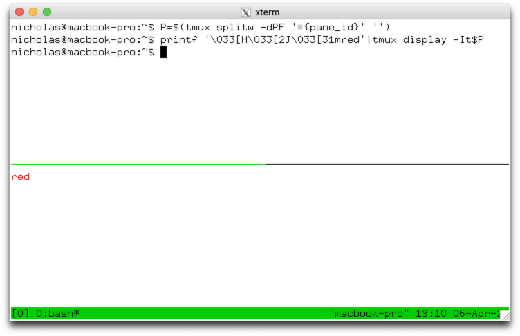

## Advanced use

### About this document

This document gives a brief description of some of tmux's more advanced
features and some examples. It is split into three sections covering:

* features most useful when using tmux interactively;

* those for scripting with tmux;

* and advanced configuration.

However, many of the features discussed are useful both interactively and when
scripting.

### Using tmux

#### Socket and multiple servers

tmux creates a directory for the user in `/tmp` and the server then creates a
socket in that directory. The default socket is called `default`, for example:

~~~~
$ ls -l /tmp/tmux-1000/default
srw-rw----  1 nicholas  wheel     0B Mar  9 09:05 /tmp/tmux-1000/default=
~~~~

Sometimes it is convenient to create separate tmux servers, perhaps to ensure
an important process is completely isolated or to test a tmux configuration.
This can be done by using the `-L` flag which creates a socket in `/tmp` but
with a name other than `default`. To start a server with the name `test`:

~~~~
$ tmux -Ltest new
~~~~

Alternatively, tmux can be told to use a different socket file outside `/tmp`
with the `-S` flag:

~~~~
$ tmux -S/my/socket/file new
~~~~

The socket used by a running server can be seen with the `socket_path` format.
This can be printed using the `display-message` command with the `-p` flag:

~~~~
$ tmux display -p '#{socket_path}'
/tmp/tmux-1000/default
~~~~

If the socket is accidentally deleted, it can be recreated by sending the
`USR1` signal to the tmux server:

~~~~
$ pkill -USR1 tmux
~~~~

#### Alerts and monitoring

An alert is a way of notifying the user when something happens in a pane in a
window. tmux supports three kinds of alerts:

* Bell: when the program sends an ASCII `BEL` character. This is turned on or
  off with the `monitor-bell` option.

* Activity: when any output is received from the program. This is turned on or
  off with the `monitor-activity` option.

* Silence: when no output is received from the program. A time period in
  seconds during which there must be no output is set with the
  `monitor-silence` option. A period of zero disables this alert.

An alert in a pane does two things for each session containing the pane's
window.

Firstly, it sets a flag on the window in the window list, but only if the window is not
the current window. While this flag is set:

* The window is drawn in the window list using the style in the
  `window-status-bell-style` (for bell) or `window-status-activity-style` (for
  activity and silence) options. The default is to use the reverse attribute.

* The window name is followed by a `!` for bell, a `#` for activity and a `~`
  for silence.

Alert flags on a window are cleared as soon as the window becomes the current
window. All flags in a session may be cleared by using `kill-session` with the
`-C` flag:

~~~~
:kill-session -C
~~~~

The `C-b M-n` and `C-b M-p` key bindings move to the next or previous window
with an alert, using the `-a` flag to the `next-window` and `previous-window`
commands.

Secondly, it may show a message in the status line, sound a bell in the outside
terminal, or both. Whether this is a bell or a message is controlled by the
`visual-bell`, `visual-activity` and `visual-silence` options. The choice of
when to take this action is controlled by the `bell-action`, `activity-action`
and `silence-action` options which may be:

Value|Meaning
---|---
`any`|An alert in any window in the session triggers an action
`none`|No action is triggered in the session
`current`|An alert is triggered for a bell, activity or silence in the current window but not other windows
`other`|An alert is triggered for a bell, activity or silence in any window except the current window

#### Working directories

Each tmux session has default working directory. This is the working directory
used for each new pane.

A session's working directory is set when it is first created:

* It may be given with the `-c` flag to `new-session`, for example:

~~~~
$ tmux new -c/tmp
~~~~

* If the session is created from a key binding or from the command prompt, it
  is the working directory of the attached session

* If the session is created from the shell prompt inside or outside tmux, it is
  the working directory of the shell.

A session's working directory may be changed with the `-c` flag to
`attach-session`, for example:

~~~~
:attach -c/tmp
~~~~

When a window or pane is created, a working directory may be given with `-c` to
`new-window` or `split-window`. This is used instead of the session's default
working directory:

~~~~
:neww -c/tmp
~~~~

Or:

~~~~
:splitw -c/tmp
~~~~

tmux can try to read the current working directory of a pane from outside the
pane. This is available in the `pane_current_path` format. This changes the
`C-b "` binding to create a new pane with the same working directory as the
active pane:

~~~~
bind '"' splitw -c '#{pane_current_path}'
~~~~

#### Linking windows

XXX

#### Respawning panes and windows

Respawning a pane or window is a way to start a different (or restart the same)
program without need to recreate the window, maintaining its size, position and
index.

The `respawn-pane` command respawns a pane and `respawn-window` a window. By
default, they run the same program as the pane or window as initially created
with `split-window` or `new-window`:

~~~~
:respawn-pane
~~~~

A different command may be given as arguments:

~~~~
:respawn-pane top
~~~~

If a program is still running in the pane or window, the commands will refuse
to work. The `-k` flag kills the program in the window before starting the new
one:

~~~~
:respawn-pane -k top
~~~~

Like `split-window`, `respawn-pane` and `respawn-window` have a `-c` flag to
set the working directory.

`respawn-pane` and `respawn-window` are useful with the `remain-on-exit`
option. When this is on, panes are not automatically killed when the program
running in them exits. Instead, a message is shown and the pane remains as it
was. This is called a dead pane, and `respawn-pane` or `respawn-window` can be
used to start the same or a different program.

#### Window sizes

Every window has a size, its horizontal and vertical dimensions. A window's
size is determined from the size of the clients attached to sessions it is
linked to. How this is done is controlled by the `window-size` option which may
be:

Value|Meaning
---|---
`largest`|The window has the size of the largest attached client; only part of the window is shown on smaller clients
`smallest`|The window has the size of the smallest attached client; on larger clients any unused space is filled with the `·` character
`latest`|The window has the size of the client which has been most recently used, for example by typing into it
`manual`|The window size is fixed; new windows use the `default-size` option and may be resized with the `resize-window` command

A window's size is not changed when it not linked to sessions that are
attached.

If a window has never been linked to an attached session - for example when
created as part of `new-session` with `-d` - it gets its size from the
`default-size` option. This is a session option with a default of 80x24:

~~~~
$ tmux show -g default-size
80x24
~~~~

When a session is created, its `default-size` option may be set at the same
time with the `-x` and `-y` flags:

~~~~~
$ tmux new -smysession -d -x160 -y48
$ tmux show -tmysession default-size
default-size 160x48
$ tmux lsw -tmysession
0: ksh* (1 panes) [160x48] [layout cc01,160x48,0,0,4] @4 (active)
~~~~~

When a window is larger than the client showing it, the visible area tracks the
cursor position. These keys may be used to view different areas of the window.

Key|Function
---|---
`C-b S-Up`|Move the visible area up
`C-b S-Down`|Move the visible area down
`C-b S-Left`|Move the visible area left
`C-b S-Right`|Move the visible area right
`C-b DC` (`C-b Delete`)|Return to tracking the cursor position

The visible area is a property of the client, so detaching the client or
changing the current window will reset to the cursor position. These keys are
bound to the `refresh-client` command.

A window size for an existing window may be set using the `resize-window`
commmand. This sets the size and automatically sets the `window-size` option to
`manual` for that window. For example:

~~~~
:resizew -x200 -y100
~~~~

To adjust the size up (`-U`), down (`-D`), left (`-L`) or right (`-R`):

~~~~
:resizew -L 20
~~~~

Or return to working out the size from attached clients:

~~~~
:resizew -A
~~~~

#### Session groups

XXX

#### Piping pane changes

tmux allows any new changes to a pane to be piped to a command. This may be
used to, for example, make a log of a pane. The `pipe-pane` command does this:

~~~~
:pipe-pane 'cat >~/mypanelog'
~~~~

No arguments stops piping:

~~~~
:pipe-pane
~~~~

The `-I` flag to `pipe-pane` sends the output of a command to a pane. For
example this will send `foo` to the pane as if it had been typed:

~~~~
:pipe-pane -I 'echo foo'
~~~~

Used like this, `pipe-pane` with `-I` is similar to the `send-keys` command
covered in a later section.

The `-o` flag will toggle piping - starting if it is not already started,
otherwise stopping it. This is useful to start and stop from a single key
binding:

~~~~
bind P pipe-pane -o 'cat >~/mypanelog'
~~~~

#### Pane titles and the terminal title

Each pane in tmux has a title. A pane's title can be set by the program running
in the pane. If the program was running outside tmux it would set the outside
terminal title - normally shown in the *X(7)* window title. Because tmux can
have multiple programs running inside it, there is a pane title for each rather
than only one. The pane title is different from the window name which is used
only by tmux and is the same for all panes in a window.

Programs inside tmux can set the pane title using an escape sequence that looks
like this:

~~~~
$ printf '\033]2;title\007'
~~~~

tmux shows the pane title for the active pane in quotes on the right of the
status line.

The pane title for a pane can be changed from tmux using the `-T` flag to the
`select-pane` command:

~~~~
:selectp -Tmytitle
~~~~

However there is nothing to stop the program inside tmux changing the title
again after this.

tmux can set the outside terminal title itself, this is controlled by the
`set-titles` option:

~~~~
set -g set-titles on
~~~~

The default title includes the names of the attached session and current window
as well as the pane title for the active pane and the indexes of any windows
with alerts. This can be changed with the `set-titles-string` option. For
example, this uses the pane title alone:

~~~~
set -g set-titles-string '#{pane_title}'
~~~~

#### Mouse key bindings

tmux handles most mouse behaviour by mapping mouse events to key bindings.
Mouse keys have special names which are the event, followed by the button
number if any, then the area where the mouse event took place. For example:

- `MouseDown1Pane` for mouse button 1 pressed down with the mouse over a pane;

- `DoubleClick2Status` for mouse button 2 double-clicked on the status line;

- `MouseDrag1Pane` and `MouseDragEnd1Pane` for mouse drag start and end on a
  pane.

- `WheelUpStatusLeft` for mouse wheel up on the left of the status line

Terminals only support three buttons and the mouse wheel.

The possible mouse events are:

Event|Description
---|---
WheelUp|Mouse wheel up
WheelDown|Mouse wheel down
MouseDown|Mouse button down
MouseUp|Mouse button up
MouseDrag|Mouse drag start
MouseDragEnd|Mouse drag end
DoubleClick|Double click
TripleClick|Triple click

The possible areas where a mouse event may take place are:

Area|Description
---|---
Pane|The contents of a pane
Border|A pane border
Status|The status line window list
StatusLeft|The left part of the status line
StatusRight|The right part of the status line
StatusDefault|Any other part of the status line

Commands bound to a mouse key binding can use `-t` with the mouse target (`=`
or `{mouse}`) to tell tmux they want to use the pane or window where the mouse
event took place. For example this binds a double-click on the status line
window list to zoom the active pane of a window:

~~~~
bind -Troot DoubleClick1Status resizep -Zt=
~~~~

When the program running in a pane can itself handle the mouse, `send-keys` can
be used with the `-M` flag to pass the mouse event through to that program. The
`mouse_any_flag` format variable is true if the program has turned the mouse
on. For example, this binding makes button 2 paste, unless used over a pane
which is in a mode or where the program has enabled the mouse for itself:

~~~~
bind -Troot MouseDown2Pane selectp -t= \; if -F "#{||:#{pane_in_mode},#{mouse_any_flag}}" "send -M" "paste -p"
~~~~

#### The environment

XXX

### Scripting tmux

#### Basics of scripting

tmux is designed to be easy to script. Almost all commands work the same way
when run using the `tmux` binary as when run from a key binding or the command
prompt inside tmux.

tmux is normally scripted using shell script but of course other languages can
be used. All examples in this document are intended for a shell based on the
Bourne shell.

Formats are an important part of scripting tmux and it is useful to be familiar
with them, see [this document](https://github.com/tmux/tmux/wiki/Formats) and
[the manual page section](https://man.openbsd.org/tmux#FORMATS).

Scripts can vary widely in intended use and that can affect how they are
written. A script that is only run interactively from a key binding may be able
to assume the current window or active pane won't change while the script is
running, so have no need to worry about targets. A script designed to set up a
new session, or run from another program, may have to be more careful.

#### Unique identifiers

Every pane, window and session in tmux has a unique identifier (ID) set by the
server. Different tmux servers can use the same IDs but within a running server
each is never changed or reused.

Pane IDs are prefixed with `%` (for example `%0` or `%123`), window by `@` (for
example `@1` or `@99`) and session by `$` (for example `$3` or `$42`).

IDs allow scripts to target a pane, window or session and be guaranteed they
are always the same even if they are killed, moved or renamed.

The IDs are available with the `pane_id`, `window_id` and `session_id` format
variables:

~~~~
$ tmux lsp -F '#{session_id} #{window_id} #{pane_id}'
$0 @8 %8
$0 @8 %11
~~~~

#### Special environment variables

tmux sets two environment variables in each pane, `TMUX` and `TMUX_PANE`:

- `TMUX` is used by tmux to work out the server socket path for commands run
  inside a pane. This is commonly used to see if a script is running inside
  tmux at all:

  ~~~~
  $ [ -n "$TMUX" ] && echo inside tmux
  ~~~~
  
  The contents up to the first comma (`,`) is the socket path, the remainder is
  for internal use. One way to get the socket path:

  ~~~~
  $ echo $TMUX|awk -F, '{ print $1 }'
  ~~~~

  Note that is not necessary to do this to give the socket path to tmux with
  `-S` - tmux can work it out itself.

- `TMUX_PANE` is the pane ID:

  ~~~~
  $ echo $TMUX_PANE
  %11
  ~~~~

#### The default target

When many tmux commands are run, they have to work out which session, window or
pane they should affect. This is known as the target and is made up of a
session, a window and a pane. Not all of these components are used by every
command, for example `split-window` needs to know which window to target, but
doesn't care about the session or pane.

The target can be specified to most commands using the `-t` flag - this is
described in the next section. If `-t` is not given, the default target is
used.

How tmux works out the default target depends on where the command is run from.
There are three typical cases:

1) Commands run interatively from tmux itself, such as from a key binding or
the command prompt.

    This is the simplest: tmux knows the client where the command was run because
the user had to trigger a key binding or press `Enter` at the command prompt.
From the client, it knows the attached session and from that it knows the
current window and active pane. That is the default target.

2) Commands run from a program running inside tmux, for example typed at a
shell prompt in a pane.

   In this case, tmux doesn't know which client the command was typed into,
because it could have been run from a script, or delayed by *sleep(1)*, or
several other things.

   However, tmux may know the name of the *tty(4)* or *pty(4)* where the command
was run. If it does, it can use that to work out the pane, because each
*tty(4)* or *pty(4)* belongs to exactly one pane. Even if the *tty(4)* or
*pty(4)* isn't available, the pane ID may be in the `TMUX_PANE` environment
variable.

   If tmux can find the pane, then it has the window as well, because each pane
belongs to one window. If that window belongs to only one session, that gives
the session, window and pane for the default target.

   If the window belongs to multiple sessions, then tmux picks the most recently
used session. If the window is linked into the session multiple times (so it
has multiple window indexes), then the current window is used if the window is
the current window in the session, otherwise the lowest window index is used.

3) Commands run from a program running outside tmux, like a shell prompt in a
different *xterm(1)* that isn't running tmux.

   For this case, tmux has no information about the target from the environment at
all. So it picks the most recently used session and uses its current window and
active pane.

If a command sequence is used, the default target is worked out for the first
command in the sequence and the same target used for following commands, unless
those commands explicitly change the target - for example `split-window`
without `-d` changes the target for subsequent commands in the same command
sequence to the newly created pane.

#### Command targets

Most commands accept a `-t` argument to give the target session, window or pane
instead of relying on the default target. Commands typically want either a
session, a window or a pane. The usage of a command shows which; they can be
seen with `list-commands` or in the manual page. For example `send-prefix`
wants a pane so it says `-t target-pane`:

~~~~
$ tmux lscm send-prefix
send-prefix [-2] [-t target-pane]
~~~~

A target is made up of three parts: the session, window and pane. The session
and window are separated by a colon (`:`) and the window and pane by a period
(`.`):

~~~~
session:window.pane
~~~~

Any of these three components may be omitted, in which case if it is needed
tmux will work out what is most appropriate, similarly to how it works out the
default target.

If neither `:` nor `.` appears in the target, tmux interprets it differently
depending what the command needs. If the command wants `target-pane` then `-t1`
would be tried first as a pane and only as a window if there is no pane 1
found; if the command wants `target-window` then `-t1` will only look for the
window at index 1. For example note how the window changes from `@1` to `@8`
after pane 1 is created:

~~~~
$ tmux display -pt1 -F '#{window_id} #{pane_id}'
@1 %1
$ tmux splitw -d
$ tmux display -pt1 -F '#{window_id} #{pane_id}'
@8 %15
~~~~

This behaviour is effective when tmux is used interactively but for scripting
care must be taken that targets are correct. This is best done by noting
whether a command wants a session, a window or a pane and by using IDs and the
full target the command needs.

In a target, each of `session`, `window` and `pane` can have several different
forms. `session` can be given in several ways. The most useful are:

1) A session ID, such as `$1`, which will always match one session.

2) The exact name of a session prefixed with an `=`, for example `=mysession`.
This will only match the session named `mysession`.

3) The start of a session name. For example, `my` will match `mysession` or
`myothersession`.

4) A pattern to match against the session name. This can have `*` and `?`
wildcards: `f*` will match `foo` but not `bar`.

The most useful forms of `window` are:

1) A window ID, such as `@42`.

2) A window index, for example `1` for window 1, `99` for window `99`.

3) `{start}` (or `^`) for the lowest window index or `{end}` (or `$`) for the
highest.

4) `{last}` (or `!`) for the last window, `{next}` (or `+`) for the next and
`{previous}` (or `-`) for the previous.

`pane` can be given as:

1) A pane ID, such as `%0`.

2) A pane index, such as `3`.

3) One of the following special tokens:

    Token|Meaning
    ---|---
    `{last}` (or `!`)|The last (previously active) pane
    `{next}` (or `+`)|The next pane by number
    `{previous}` (or `-`)|previous pane by number
    `{top}`|The top pane
    `{bottom}`|The bottom pane
    `{left}`|The leftmost pane
    `{right}`|The rightmost pane
    `{top-left}`|The top-left pane
    `{top-right}`|The top-right pane
    `{bottom-left}`|The bottom-left pane
    `{bottom-right}`|The bottom-right pane
    `{up-of}`|The pane above the active pane
    `{down-of}`|The pane below the active pane
    `{left-of}`|The pane to the left of the active pane
    `{right-of}`|The pane to the right of the active pane
     
Some examples of targets are:

Example|Description
---|---
`-t1`|Session, window or pane 1 depending on what the command needs
`-t%1`|The pane with ID `%1`; the session and window will be chosen by tmux if needed
`-t:6.%1`|The pane with ID `%1` if it exists in window 6; the session will be chosen by tmux if needed
`-t:.3`|Pane 3; the session and window will be chosen by tmux if needed
`-t=mysession:5`|Window 5 in session `mysession`; the active pane will be used if a pane is needed
`-t=mysession:5.2`|Pane 2 in window 5 in session `mysession`
`-t{last}`|The last window or last pane, depending if the command wants a window or pane
`-t:{last}`|The last window; the session and pane will be chosen by tmux if needed

#### Targets for new panes, windows and sessions

The `split-window`, `new-window` and `new-session` commands all have a `-P`
flag which prints the target of the new pane, window or session to `stdout`.
This allows scripts to reliably target it with subsequent commands.

By default the output is a full or partial target, for example:

~~~~
$ tmux new -dP
2:
~~~~

But it is more useful to use the `-F` flag to get the ID:

~~~~
$ S=$(tmux new -dPF '#{session_id}')
$6
$ tmux neww -dPF '#{window_id}' -t$S
@16
~~~~

#### Getting information

There are three main ways to get information from the tmux server: list
commands, `display-message` and `show-options`.

The list commands are `list-panes`, `list-windows` and `list-sessions`.

`list-sessions` lists all sessions in the server.

`list-windows` can be used in these ways:

- Without arguments, lists all windows in a single session.

- With `-a` lists all windows in the server.

And `list-panes` can in these ways:

- Without arguments, lists all panes in a single window.

- With `-s` lists all panes in all windows in a single session.

- With `-a` lists all panes in the entire server.

Each of these commands has a `-F` flag which gives the format each line of
output. For example, to list each window in the server and its name:

~~~~
$ tmux lsw -aF '#{window_id} #{window_name}'
@0 top
@1 emacs
@2 mywindow
@3 ksh
@4 abc🤔def
@5 ksh
~~~~

Or each pane in a single window and its size:

~~~~
$ tmux lsp -t@7 -F '#{pane_id} #{pane_width} #{pane_height}'
%7 107 43
%12 53 42
%14 53 42
~~~~

These can be combined with *sh(1)* to loop over panes:

~~~~
$ tmux lsp -F'#{pane_id}'|while read i; do echo pane $i; done
~~~~

The `display-message` command is used to print individual formats. The `-p`
flag sends output to `stdout`. For example:

~~~~
$ tmux display -p '#{pane_id}'
%8
~~~~

Or:

~~~~
$ tmux display -pt@0 '#{window_name}'
top
~~~~

Options are shown using the `show-options` command. The basics are covered [in
this section](https://github.com/tmux/tmux/wiki/Getting-Started#showing-options).
In addition, the `-v` option only shows the value:

~~~~
$ tmux show -g history-limit
history-limit 2000
$ tmux show -vg history-limit
2000
~~~~

`-q` does not show an error for unknown options:

~~~~
$ tmux show -g no-such-option
invalid option: no-such-option
$ tmux show -gq no-such-option
$
~~~~

#### Sending keys

The `send-keys` command can be used to send key presses to a pane as if they
had been pressed. It takes multiple arguments. tmux checks if each argument is
the name of a key and if so the appropriate escape sequence is sent for that
key; if the argument does not match a key, it is sent as it is. For example:

~~~~
send hello Enter
~~~~

Sends the five characters in `hello`, followed by an Enter key press (a
newline character). Or this:

~~~~
send F1 C-F2
~~~~

Sends the escape sequences for the `F1` and `C-F2` keys.

The `-l` flag tells tmux not to look for arguments as keys but instead send
every one literally, so this will send the literal text `Enter`:

~~~~
send -l Enter
~~~~

#### Capturing pane content

Existing pane content can be captured with the `capture-pane` command. This can
save its output to a paste buffer or, more usefully, write it to `stdout` by
giving the `-p` flag.

By default, `capture-pane` captures the entire visible pane content:

~~~~
$ tmux capturep -pt%0
~~~~

The `-S` and `-E` flags give the starting and ending line numbers. Zero is the
first visible line and negative lines go into the history. The special value
`-` means the start of the history or the end of the visible content. So to
capture the entire pane including the history:

~~~~
$ tmux capturep -p -S- -E-
~~~~

A few additional flags control the format of the output:

* `-e` includes escape sequences for colour and attributes;

* `-C` escapes nonprintable characters as octal sequences;

* `-N` preserves trailing spaces at the end of lines;

* `-J` both preserves trailing spaces and joins any wrapped lines.

#### Empty panes

tmux allows panes to be created without a running command. There are two ways
to create an empty pane using the `split-window` command:

1) Passing an empty command:

    ~~~~
    $ tmux splitw ''
    ~~~~

   A pane created like this starts completely empty.

2) By using the `-I` flag and providing input on `stdin`:

    ~~~~
    $ echo hello|tmux splitw -I
    ~~~~

An existing empty pane may be written to with the `-I` flag to
`display-message`:

~~~~
P=$(tmux splitw -dPF '#{pane_id}' '')
echo hello again|tmux display -It$P
~~~~

They accept escape sequences the same as if a program running in the pane was
sending them:

~~~~
printf '\033[H\033[2J\033[31mred'|tmux display -It$P
~~~~

#### Waiting, signals and locks

XXX

### Advanced configuration

#### Checking configuration files

The `source-file` command has two flags to help working with configuration
files:

* `-n` parses the file but does not execute any of the commands.

* `-v` prints the parsed form of each command to `stdout`.

These can be useful to locate problems in a configuration file, for example by
starting tmux without `.tmux.conf` and then loading it manually:

~~~~
$ tmux -f/dev/null new -d
$ tmux source -v ~/.tmux.conf
/home/nicholas/.tmux.conf:1: set-option -g mouse on
/home/nicholas/.tmux.conf:8: unknown command: foobar
~~~~

#### Command parsing

When tmux reads a configuration file, it is processed in two broad steps:
parsing and execution. The parsing process is:

1) Configuration file directives are handled, for example `%if`. These are
   described in the next section.

2) The command is parsed and split into a set of arguments. For example take
   the command:
   ~~~~
   new -A -sfoo top
   ~~~~
   It is first split up into a list of four: `new`, `-A`, `-sfoo` and `top`.

3) This list is processed again and tmux looks up the command, so it knows it
   is `new-session` with arguments `-A`, `-s foo` and `top`.

4) The command is placed at the end of a command queue.

Once all of the configuration file is parsed, execution takes place: the
commands are executed from the command queue in order.

A similar process takes place for commands read from the command prompt or as
an argument to another command (such as `if-shell`). These are pretty much the
same as a configuration file with only one line.

For commands run from the shell, steps 1 and 2 are skipped - configuration file
directives are not supported, and the shell splits the command into arguments
before giving it to tmux.

This split into parsing and execution does not often have any visible effect
but occasionally it matters. The most obvious effect is on environment variable
expansion:

~~~~
setenv -g FOO bar
display $FOO
~~~~

This will not work as expected, because the `set-environment` command takes
place during execution and the expansion of `FOO` takes place during parsing.
However, this will work:

~~~~
FOO=bar
display $FOO
~~~~

Because both `FOO=bar` and expansion of `FOO` happen during parsing. Similarly
this will work:

~~~~
setenv -g FOO bar
display '#{FOO}'
~~~~

Although the `set-environment` happens during execution, `FOO` is not used
until `display-message` is executed and expands its argument as a format.

Care must be taken with commands that take another command as an argument,
because there may be multiple parsing stages.

#### Conditional directives

tmux supports some special syntax in the configuration file to allow more
flexible configuration. This is all processed when the configuration file is
parsed.

Conditional directives allow parts of the configuration file to be processed
only if a condition is true. A conditional directive looks like this:

~~~~
%if #{format}
commands
%endif
~~~~

If the given format is true (is not empty and not 0 after being expanded), then
commands are executed. Additional branches of the `%if` may be given with
`%elif` or a false branch with `%else`:

~~~~
%if #{format}
commands
%elif #{format}
more commands
%else
yet more commands
%endif
~~~~

Because these directives are processed when the configuration file is parsed,
they can't use the results of commands - the commands (whether outside the
conditional or in the true or false branch) are not executed until later when
the configuration file has been completely parsed.

For example, this runs a different configuration file on a different host:

~~~~
%if #{==:#{host_short},firsthost}
source ~/.tmux.conf.firsthost
%elif #{==:#{host_short},secondhost}
source ~/.tmux.conf.secondhost
%endif
~~~~

#### Running shell commands

The `run-shell` command runs a shell command:

~~~~
:run 'ls'
~~~~

If there is any output, the active pane is switched into view mode. Formats are
expanded in the `run-shell` argument:

~~~~
:run 'echo window name is #{window_name}'
~~~~

`run-shell` blocks execution of subsequent commands until the command is
finished. The `-b` flag disables this and runs the command in the background.

`run-shell` is most useful to invoke shell commands or shell scripts from a
configuration file or a key binding:

~~~~
bind O run '/path/to/my/script'
~~~~

#### Conditions with `if-shell`

`if-shell` is a versatile command that allows a choice between two tmux
commands to be made based on a shell command or (with `-F`) a format. The first
argument is a condition, the second the command to run when it is true and the
third the command to run when it is false. The third command may be left out.

If `-F` is given, the first condition argument is a format. A format is true if
it expands to a string that is not empty and not 0. Without `-F`, the first
argument is a shell command.

For example, a key binding to scroll to the top if a pane is in copy mode and
do nothing if it is not:

~~~~
bind T if -F '#{==:#{pane_mode},copy-mode}' 'send -X history-top'
~~~~

Or to rename a window based on the time:

~~~~
bind A if 'test `date +%H` -lt 12' 'renamew morning' 'renamew afternoon'
~~~~

Note that `if-shell` is different from the `%if` directive. `%if` is
interpreted when a configuration file is parsed; `if-shell` is a command that
is run with other commands and can be used in key bindings.

#### Quoting with `{}`

tmux allows sections of a configuration file to be quoted using `{` and `}`.
This is designed to allow complex commands and command sequences to be
expressed more clearly, particularly where a command takes another command as
an argument. Text between `{` and `}` is treated as a string without any
modification.

So for a simple example, the `bind-key` command can take a command as its
argument:

~~~~
bind K {
	lsk
}
~~~~

Or `if-shell` may be bound to a key:

~~~~
bind K {
	if -F '#{==:#{window_name},ksh}' {
		kill-window
	} {
		display 'not killing window'
	}
}
~~~~

This is equivalent to:

~~~~
bind K if -F '#{==:#{window_name},ksh}' 'kill-window' "display 'not killing window'"
~~~~

#### Array options

Some tmux options may be set to multiple values, these are called array
options. Each value has an index which is shown in `[` and `]` after the option
name. Array indexes can have gaps, so an array with just index 0 and 999 is
fine. The array options are `command-alias`, `terminal-features`,
`terminal-overrides`, `status-format`, `update-environment` and `user-keys`.
Every hook is also an array option.

An individual array index may be set or shown:

~~~~
$ tmux set -g update-environment[999] FOO
$ tmux show -g update-environment[999]
update-environment[999] FOO
$ tmux set -gu update-environment[999]
~~~~

Or all together by omitting the index. `-u` restores the entire array option to
the default:

~~~~
$ tmux show -g update-environment
update-environment[0] DISPLAY
update-environment[1] KRB5CCNAME
update-environment[2] SSH_ASKPASS
update-environment[3] SSH_AUTH_SOCK
update-environment[4] SSH_AGENT_PID
update-environment[5] SSH_CONNECTION
update-environment[6] WINDOWID
update-environment[7] XAUTHORITY
update-environment[999] FOO
$ tmux set -gu update-environment
$ tmux show -g update-environment
update-environment[0] DISPLAY
update-environment[1] KRB5CCNAME
update-environment[2] SSH_ASKPASS
update-environment[3] SSH_AUTH_SOCK
update-environment[4] SSH_AGENT_PID
update-environment[5] SSH_CONNECTION
update-environment[6] WINDOWID
update-environment[7] XAUTHORITY
~~~~

The `-a` flag to `set-option` appends to an array option using the next free index:

~~~~
$ tmux set -ag update-environment 'FOO'
$ tmux show -g update-environment
update-environment[0] DISPLAY
update-environment[1] KRB5CCNAME
update-environment[2] SSH_ASKPASS
update-environment[3] SSH_AUTH_SOCK
update-environment[4] SSH_AGENT_PID
update-environment[5] SSH_CONNECTION
update-environment[6] WINDOWID
update-environment[7] XAUTHORITY
update-environment[8] FOO
~~~~

`-a` can accept multiple values separated by commas. For backwards
compatibility with old tmux versions where arrays were kept as strings, a
leading comma can be given:

~~~~
$ tmux set -ag update-environment ',FOO,BAR'
~~~~

#### Command aliases

tmux allows custom commands by defining command aliases. Note this is different
from the short alias of each command (such as `lsw` for `list-windows`).
Command aliases are defined with the `command-alias` server option. This is an
array option where each entry has a number.

The default has a few settings for convenience and a few for backwards
compatibility:

~~~~
$ tmux show -s command-alias
command-alias[0] split-pane=split-window
command-alias[1] splitp=split-window
command-alias[2] "server-info=show-messages -JT"
command-alias[3] "info=show-messages -JT"
command-alias[4] "choose-window=choose-tree -w"
command-alias[5] "choose-session=choose-tree -s"
~~~~

Taking `command-alias[4]` as an example, this means that the `choose-window`
command is expanded to `choose-tree -w`.

A custom command alias is added by adding a new index to the array. Because the
defaults start at index 0, it is best to use higher numbers for additional
command aliases:

~~~~
:set -s command-alias[100] 'sv=splitw -v'
~~~~

This option makes `sv` the same as `splitw -v`:

~~~~
:sv
~~~~

Any subsequent flags or arguments given to the entered command are appended to
the replaced command. This is the same as `splitw -v -d`:

~~~~
:sv -d
~~~~

#### User options

tmux allows custom options to be set, these are called user options and can be
pane, window, session or server options. All user options are strings and the
names must be prefixed by `@`. There are no other restrictions on the value.

User options can be used to store a custom value from a script or key binding.
Because tmux doesn't already know about the option name, the `-w` flag must be
given for window options, or `-s` for server. For example to set an option on
window 2 with the window name:

~~~~
$ tmux set -Fwt:2 @myname '#{window_name}'
$ tmux show -wt:2 @myname
@mytime ksh
~~~~

Or a global session option:

~~~~
$ tmux set -g @myoption 'foo bar'
$ tmux show -g @myoption
foo bar
~~~~

User options are useful for scripting, see [this section as
well](Advanced-Use#getting-information).

#### User keys

tmux allows a set of custom key definitions. This is useful on the rare
occasion where terminals send (or can be configured to send) unusual keys
sequences that are not recognised by tmux by default.

User keys are added with the `user-keys` server option. This is an array option
where each item is a sequence that tmux matches to a `UserN` key. For example:

~~~~
set -s user-keys[0] '\033[foo'
~~~~

With this, when the sequence `\033[foo` is received from the terminal, tmux
will fire a `User0` key that can be bound as normal:

~~~~
bind -n User0 list-keys
~~~~

`user-keys[1]` maps to `User1`, `user-keys[2]` to `User2` and so on.

#### Custom key tables

A custom key table is one with a name other than the four default (`root`,
`prefix`, `copy-mode` and `copy-mode-vi`). Binding a key in a table creates
that table, for example this creates a key table called `mytable` with
`list-keys` bound to `x`:

~~~~
bind -Tmytable x list-keys
~~~~

Each client has a current key table, which may be set to no key table. The way
key processing works when a key is pressed is:

1) If the key matches the `prefix` or `prefix2` options, the client is switched
   into the `prefix` key table and tmux then waits for another key press.

2) If it doesn't match, the key is looked up in the client's key table. If the
   client has no key table, it is first switched into the key table given by
   the `key-table` option (or the `copy-mode` or `copy-mode-vi` key table if in
   copy mode).

3) If a key binding is found in the table, its command is executed. If no key
   binding is found, tmux looks for an `Any` key binding and if one is found
   executes its command instead.

4) If the key does not repeat, the client is reset to no key table and waits
   for the next key press. If it does repeat, the client is left with the key
   table where the key was found so the next key press will also try that table
   first.

The `switch-client` command's `-T` flag can be used to explicitly set the
client's key table, so when the next key is pressed, it is looked up in that
key table. This can be used to bind chains of commands or to have multiple
prefixes with different commands. For example, to make pressing `C-x` then `x`
execute `list-keys`, first create a key table with an `x` binding, then a root
binding for `C-x` to switch to that key table:

~~~~
bind -Tmytable x list-keys
bind -Troot C-x switch-client -Tmytable
~~~~

To entirely change the `root` key table for a single session, the `key-table`
option can be changed:

~~~~
set -tmysession: key-table mytable
~~~~

#### Automatic rename

XXX

#### *terminfo(5)* and `terminal-overrides`

XXX

#### The system clipboard

tmux can update the system clipboard when text is copied, for information see
[this document](https://github.com/tmux/tmux/wiki/Clipboard).

#### Running with no sessions

XXX

#### Hooks

XXX
