## Getting started

### About tmux

tmux is a program which runs in a terminal and allows multiple other terminal
programs to be run inside it. Each program inside tmux gets its own terminal
managed by tmux, which can be accessed from the single terminal where tmux is
running - this called multiplexing and tmux is a terminal multiplexer.

tmux - and any programs running inside it - may be detached from the terminal
where it is running (the outside terminal) and and later reattached to the same
or another terminal.

Programs run inside tmux may be full screen interactive programs like *vi(1)*
or *top(1)*, shells like *bash(1)* or *ksh(1)*, or any other program that can
be run in a Unix terminal.

There is a powerful feature set to access, manage and organize programs inside
tmux, both interactively and from scripts.

The main uses of tmux are to:

* Protect running programs on a remote server from connection drops by running
  them inside tmux.

* Allow programs running on a remote server to be accessed from multiple
  different local computers.

* Work with multiple programs and shells together in one terminal, a bit like a
  window manager.

For example:

* A user connects to a remote server using *ssh(1)* from an *xterm(1)* on their
  work computer and run several programs. perhaps an editor, a compiler and a
  few shells.

* They work with these programs interactively, perhaps start compiling, then
  close the *xterm(1)* with tmux and go home for the day.

* They are then able to connect to the same remote server from home, attach to
  tmux, and continue from where they were previously.

Here is a screenshot of tmux in an *xterm(1)* showing the shell:

### Installing tmux

tmux may be installed from package management systems on most major platforms.
See [this document](Installing.md) for instructions on how to install tmux or
how to build it from source.

Note that this document may mention features only available in the latest tmux
release. Only the latest tmux release is supported. Releases are made
approximately every six months.

### Other documentation and help

Here are several places to find documentation and help about tmux:

- 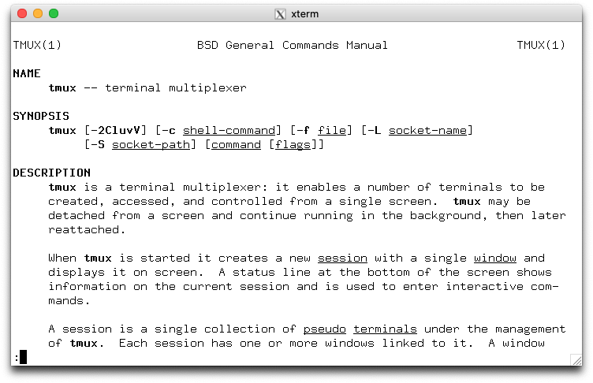[The manual
  page](https://man.openbsd.org/tmux) has detailed reference documentation on
  tmux and a description of every command, flag and option. Once tmux is
  installed it is also available in section 1:

  ~~~~
  $ man 1 tmux
  ~~~~

- [The FAQ](FAQ.md) has solutions to commonly asked questions, mostly about
  specific configuration issues.

- The [#tmux IRC channel on freenode](irc://irc.freenode.net/tmux).

- The [tmux-users@googlegroups.com mailing list](mailto:tmux-users@googlegroups.com).

### Basic concepts

tmux has a set of basic concepts and terms with which it is important to be
familiar. This section gives a description of how the terminals inside tmux are
grouped together and the various terms tmux uses.

#### The tmux server and clients

tmux keeps all its state in a single main process, called the tmux server. This
runs in the background and manages all the programs running inside tmux and
keeps track of their output. The tmux server is started automatically when the
user runs a tmux command and by default exits when there are no running
programs.

Users attach to the tmux server by starting a client. This takes over the
terminal where it is run and talks to the server using a socket file in `/tmp`.
Each client runs in one terminal, which may be an X terminal such as
*xterm(1)*, the system console, or a terminal inside another program (such as
tmux itself). Each client is identified by the name of the outside terminal
where it is started, for example `/dev/ttypf`.

#### Sessions, windows and panes

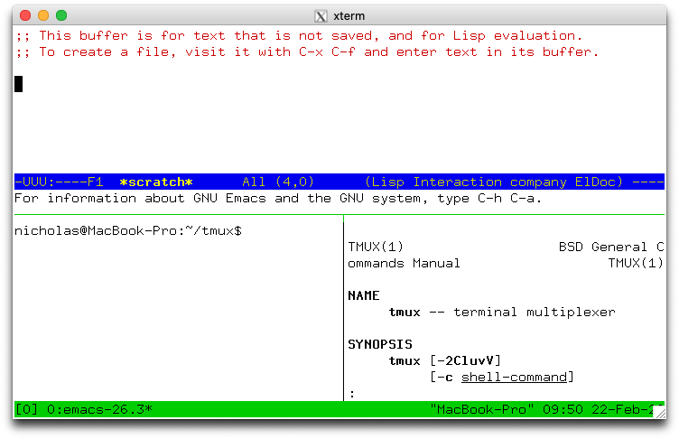
Every terminal inside tmux belongs to one pane, this is a rectangular area
which shows the content of the terminal inside tmux. Because each terminal
inside tmux is shown in only one pane, the term pane can be used to mean all of
the pane, the terminal and the program running inside it. The screenshot to the
right shows tmux with panes.

Each pane appears in one window. A window is made up of one or more panes which
together cover its entire area - so multiple panes may be visible at the same
time. A window normally takes up the whole of the terminal where tmux is
attached, but it can be bigger or smaller. The sizes and positions of all the
panes in a window is called the window layout.

Every window has a name - by default tmux will choose one but it can be changed
by the user. Window names do not have to be unique, windows are usually
identified by the session and the window index rather than their name.

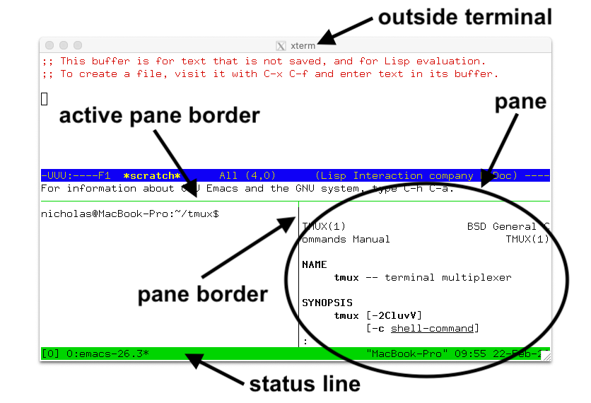
Each pane is separated from the panes around it by a line, this is called the
pane border. There is one pane in each window called the active pane, this is
where any text typed is sent and is the default pane used for commands that
target the window. The pane border of the active pane is marked in green, or if
there are only two panes then the top, bottom, left or right half of the border
is green.

Multiple windows are grouped together into sessions. If a window is part of a
session, it is said to be linked to that session. Windows may be linked to
multiple sessions at the same time, although mostly they are only in one. Each
window in a session has a number, called the window index - the same window may
be linked at different indexes in different sessions. A session's window list
is all the windows linked to that session in order of their indexes.

Each session has one current window, this is the window displayed when the
session is attached and is the default window for any commands that target the
session. If the current window is changed, the previous current window becomes
known as the last window.

A session may be attached to one or more clients, which means it is shown on
the outside terminal where that client is running. Any text typed into that
outside terminal is sent to the active pane in the current window of the
attached session. Sessions do not have an index but they do have a name, which
must be unique.

In summary:

* Programs run in terminals in panes, which each belong to one window.
* Each window has a name and one active pane.
* Windows are linked to one or more sessions.
* Each session has a list of windows, each with an index.
* One of the windows in a session is the current window.
* Sessions are attached to zero or more clients.
* Each client is attached to one session.

#### Summary of terms

Term|Description
---|---
Client|Attaches a tmux session from an outside terminal such as *xterm(1)*
Session|Groups one or more windows together
Window|Groups one or more panes together, linked to one or more sessions
Pane|Contains a terminal and running program, appears in one window
Active pane|The pane in the current window where typing is sent; one per window
Current window|The window in the attached session where typing is sent; one per session
Last window|The previous current window
Session name|The name of a session, defaults to a number starting from zero
Window list|The list of windows in a session in order by number
Window name|The name of a window, defaults to the name of the running program in the active pane
Window index|The number of a window in a session's window list
Window layout|The size and position of the panes in a window

### Using tmux interactively

#### Creating sessions

To create the first tmux session, run tmux from the shell. A new session is
created using the `new-session` command - `new` for short:

~~~~
$ tmux new
~~~~

Without arguments, `new-session` creates a new session and attaches it. Because
this is the first session, the tmux server is started and the tmux run from the
shell becomes the first client and attaches to it.

The new session will have one window (at index 0) with a single pane containing
a shell. The shell prompt should appear at the top of the terminal and the
green status line at the bottom (more on the status line is below).

By default, the first session will be called `0`, the second `1` and so on.
`new-session` allows a name to be specified for the session with the `-s` flag:

~~~~
$ tmux new -smysession
~~~~

This creates a new session called `mysession`. A command may be given instead
of running a shell by passing additional arguments. If one argument is given,
tmux will pass it to the shell, if more than one it runs the command directly.
For example these run *emacs(1)*:

~~~~
$ tmux new 'emacs ~/.tmux.conf'
~~~~

Or:

~~~~
$ tmux new -- emacs ~/.tmux.conf
~~~~

By default, tmux calls the first window in the session after whatever is
running in it. The `-n` flag gives a name to use instead, in this case a window
`mytopwindow` running *top(1)*:

~~~~
$ tmux new -nmytopwindow top
~~~~

`new-session` has other flags - some are covered below. A full list is [in the
tmux manual](https://man.openbsd.org/tmux#new-session).

#### The status line

When a tmux client is attached, it shows a status line on the bottom line of
the screen. By default this is green and shows:

* On the left, the name of the attached session: `[0]`.

* In the middle, a list of the windows in the session, with their index, for
  example with one window called `ksh` at index 0: `0:ksh`.

* On the right, the pane title in quotes (this defaults to the name of the host
  running tmux) and the time and the date.

As new windows are opened, the window list grows - if there are too many
windows to fit on the width of the terminal, a `<` or `>` will be added at the
left or right or both to show there are hidden windows.

In the window list, the current window is marked with a `*` after the name, and
the last window with a `-`.

#### The prefix key

Once a tmux client is attached, any keys entered are forwarded to the program
running in the active pane of the current window. For keys that control tmux
itself, a special key must be pressed first - this is called the prefix key.

The default prefix key is `C-b`, which means the `Ctrl` key and `b`. In tmux,
modifier keys are shown by prefixing a key with `C-` for the control key, `M-`
for the meta key (normally `Alt` on modern computers) and `S-` for the shift
key. These may be combined together, so 'C-M-x' means pressing the control key,
meta key and `x` together.

When the prefix key is pressed, tmux waits for another key press and that
determines what tmux command is executed. Keys like this are shown here with a
space between them: `C-b c` means first the prefix key `C-b` is pressed, then
it is released and then the `c` key is pressed. Care must be taken to release
the `Ctrl` key after pressing `C-b` if necessary - `C-b c` is different from
`C-b C-c`.

#### Help keys

Every default tmux key binding has a short description to help remember what
the key does. A list of all the keys can be seen by pressing `C-b ?`.

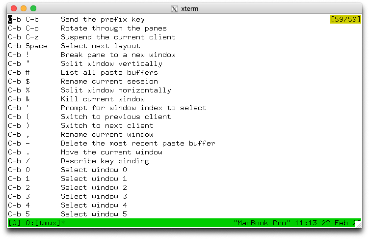

`C-b ?` enters view mode to show text. A pane in view mode has its own key
bindings which do not need the prefix key. These broadly follow *emacs(1)*. The
most important are `Up`, `Down`, `C-Up`, `C-Down` to scroll up and down, and
`q` to exit the mode. The line number of the top visible line together with the
total number of lines is shown in the top right.

Alternatively, the same list can be seen from the shell by running:

~~~~
$ tmux lsk -N|more
~~~~

`C-b /` shows the description of a single key - a prompt at the bottom of the
terminal appears. Pressing a key will show its description in the same place.
For example, pressing `C-b /` then `?` shows:

~~~~
C-b ? List key bindings
~~~~

#### Commands and flags

tmux has a large set of commands. These all have a name like `new-window` or
`new-session` or `list-keys` and many also have a shorter alias like `neww` or
`new` or `lsk`.

Any time a key binding is used, it runs one or more tmux commands. For example,
`C-b c` runs the `new-window` command.

Commands can also be used from the shell, as with `new-session` and `list-keys`
above.

Each command has zero or more flags, in the same way as standard Unix commands.
Flags may or may not take a single argument themselves. In addition, commands
may take additional arguments after the flags. Flags are passed after the
command, for example to run the `new-session` command (alias `new`) with flags
`-d` and `-n`:

~~~~
$ tmux new-session -d -nmysession
~~~~

All commands and their flags are documented in the tmux manual page.

This document focuses on the available key bindings, but commands are mentioned
for information or where there is a useful flag. They can be entered from the
shell or from the command prompt, described in the next section.

#### The command prompt

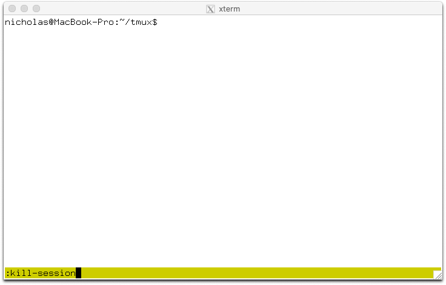

tmux has an interactive command prompt. This can be opened by pressing `C-b :`
and appears instead of the status line, as shown in this screenshot.

At the prompt, commands can be entered similarly to how they are at the shell.
Output will either be shown for a short period in the status line, or switch
the active pane into view mode.

#### Attaching and detaching

Detaching from tmux means that the client exits and detaches from the outside
terminal, returning to the shell and leaving the tmux session and any programs
inside it running in the background. To detach tmux, use the `C-b d` key
binding.

The `attach-session` command attaches to an existing session. Without
arguments, it will attach to the most recently used session that is not already
attached:

~~~~
$ tmux attach
~~~~

Or `-t` gives the name of a session to attach to:

~~~~
$ tmux attach -tmysession
~~~~

By default, attaching to a session does not detach any other clients attached
to the same session. To do this, add the `-d` flag:

~~~~
$ tmux attach -dtmysession
~~~~

The `new-session` command has a `-A` flag to attach to an existing session if
it exists, or create a new one if it does not. For a session named `mysession`:

~~~~
$ tmux new -Atmysession
~~~~

The `-D` flag may be added to make `new-session` also behave like
`attach-session` with `-d` and detach any other clients attached to the
session.

#### Listing sessions

The `list-session` command (alias `ls`) shows a list of available sessions that
can be attached. This shows four sessions called `1`, `2`, `myothersession` and
`mysession`:

~~~~
$ tmux ls
1: 3 windows (created Sat Feb 22 11:44:51 2020)
2: 1 windows (created Sat Feb 22 11:44:51 2020)
myothersession: 2 windows (created Sat Feb 22 11:44:51 2020)
mysession: 1 windows (created Sat Feb 22 11:44:51 2020)

~~~~

#### Killing tmux entirely

If there are no sessions, windows or panes inside tmux, the server will exit.
It can also be entirely killed using the `kill-server` command. For example, at
the command prompt:

~~~~
:kill-server
~~~~

#### Creating new windows

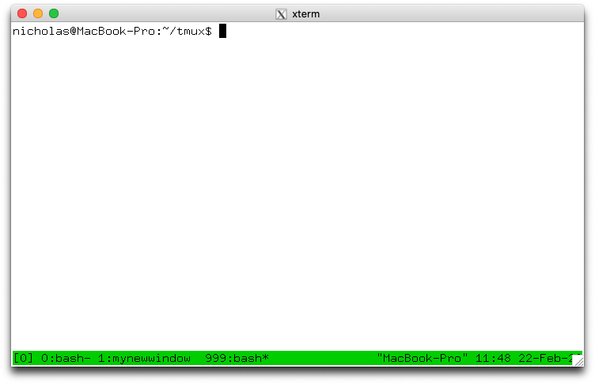

A new window can be created in an attached session with the `C-b c` key
binding which runs the `new-window` command. The new window is created at the
first available index - so the second window will have index 1. The new window
becomes the current window of the session.

If there are any gaps in the window list, they are filled by new windows. So if
there are windows with indexes 0 and 2, the next new window will be created as
index 1.

The `new-window` command has some useful flags which can be used with the
command prompt:

* The `-d` flag creates the window, but does not make it the current window.

* `-n` allows a name for the new window to be given. For example using the
  command prompt to create a window called `mynewwindow` without making it the
  current window:

  ~~~~
  :neww -dnmynewwindow
  ~~~~

* The `-t` flag specifies a target for the window. Command targets have a
  special syntax, but for simple use with `new-window` it is enough just to
  give a window index. This creates a window at index 999:

  ~~~~
  :neww -t999
  ~~~~

A command to be run in the new window may be given to `new-window` in the same
way as `split-window`. For example to create a new window running *top(1)*:

~~~~
:neww top
~~~~

#### Splitting the window

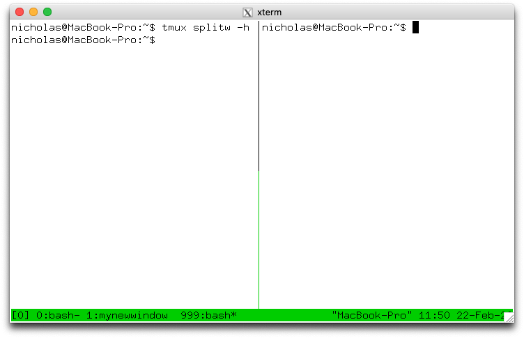

A pane is created by splitting a window. This is done with the `split-window`
command which is bound to two keys by default:

* `C-b %` splits the current pane into two horizontally, producing two panes
  next to each other, one on the left and one on the right.

* `C-b "` splits the current pane into two vertically, producing two panes one
  above the other.

Each time a pane is split into two, each of those panes may be split again
using the same key bindings, until the pane becomes too small.

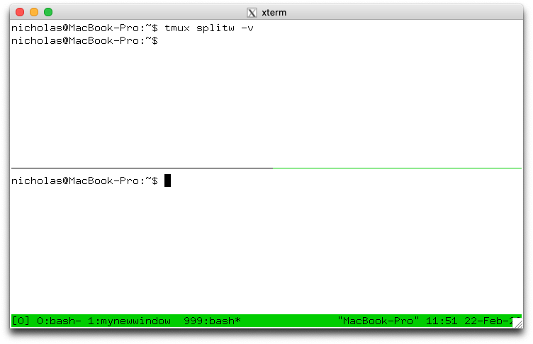

`split-window` has several useful flags:It isn't sexism, it is just a mistake, slightly thoughtless at worst. Reaching straight for sexism, casual or otherwise, is also a little thoughtless as well as unnecessarily rude.

* `-h` does a horizontal split and `-v` a vertical split.

* `-d` does not change the active pane to the newly created pane.

* `-f` makes a new pane spanning the whole width or height of the window
  instead of being constrained to the size of the pane being split.

* `-b` puts the new pane to the left or above of the pane being split instead
  of to the right or below.

A command to be run in the new pane may be given to `split-window` in the same
way as `new-session` and `new-window`.

#### Changing the current window

There are several key bindings to change the current window of a session:

* `C-b 0` changes to window 0, `C-b 1` to window 1, up to window `C-b 9` for
  window 9.

* `C-b '` prompts for a window index and changes to that window.

* `C-b n` changes to the next window in the window list by number. So pressing
  `C-b n` when in window 1 will change to window 2 if it exists.

* `C-b p` changes to the previous window in the window list by number.

* `C-b l` changes to the last window, which is the window that was last the
  current window before the window that is now.

These are all variations of the `select-window` command.

#### Changing the active pane

The active pane can be changed between the panes in a window with these key
bindings:

* `C-b Up`, `C-b Down`, `C-b Left` and `C-b Right` change to the pane above,
  below, left or right of the active pane. These keys wrap around the window,
  so pressing `C-b Down` on a pane at the bottom will change to a pane at the
  top.

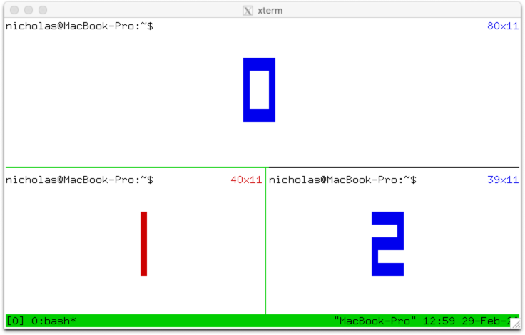

* `C-b q` prints the pane numbers and their sizes on top of the panes for a
  short time. Pressing one of the number keys before they disappear changes the
  active pane to the chosen pane, so `C-b q 1` will change to pane number 1.

* `C-b o` moves to the next pane by pane number and `C-b C-o` swaps that pane
  with the active pane, so they exchange positions and sizes in the window.

These use the `select-pane` and `display-panes` commands.

Pane numbers are not fixed, instead panes are numbered by their position in the
window, so if the pane with number 0 is swapped with the pane with number 1,
the numbers are swapped as well as the panes themselves.

#### Choosing sessions, windows and panes

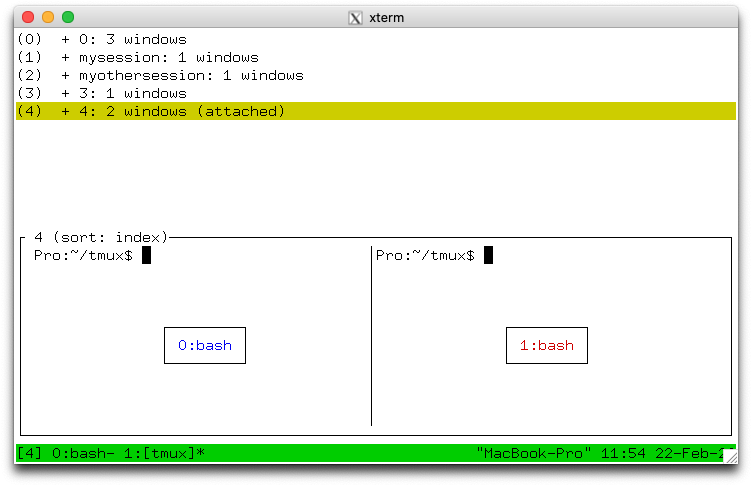
tmux includes a mode where sessions, windows or panes can be chosen from a
tree, this is called tree mode. It can be used browse sessions, windows and
panes; to change the attached session, the current window or active pane; to
kill sessions, windows and panes; or apply a command to several at once by
tagging them.

There are two key bindings to enter tree mode: `C-b s` starts showing only
sessions and with the attached session selected; `C-b w` starts with sessions
expanded so windows are shown and with the current window in the attached
session selected.

Tree mode splits the window into two sections: the top half has a tree of
sessions, windows and panes and the bottom half has a preview of the area
around the cursor in each pane. For sessions the preview shows the active panes
in as many windows will fit; for windows as many panes as will fit; and for
panes only the selected pane.

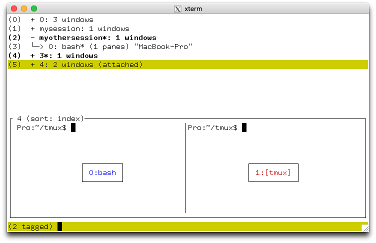

Keys to control tree mode do not require the prefix. The list may be navigated
with the `Up` and `Down` keys. `Enter` changes to the selected item (it becomes
the attached session, current window or active pane) and exits the mode.
'Right' expands the item if possible - sessions expand to show their windows
and windows to show their panes. `Left` collapses the item to hide any windows
or panes. `O` changes the order of the items and `q` exits tree mode.

Items in the tree are tagged by pressing `t` and untagged by pressing `t`
again. Tagged items are shown in bold and with `*` after their name. All tagged
items may be untagged b pressing `T`. Tagged items may be killed together by
pressing `X`, or a command applied to them all by pressing `:` for a prompt.

Each item in the tree has as shortcut key in brackets at the start of the line.
Pressing this key will immediately choose that item (as if it had been selected
and `Enter` pressed). The first ten items are keys `0` to `9` and after that
keys `M-a` to `M-z` are used.

This is a list of the keys available in tree mode without pressing the prefix
key:

Key|Function
---|---
`Enter`|Change the attached session, current window or active pane
`Up`|Select previous item
`Down`|Select next item
`Right`|Expand item
`Left`|Collapse item
`x`|Kill selected item
`X`|Kill tagged items
`<`|Scroll preview left
`>`|Scroll preview right
`C-s`|Search by name
`n`|Repeat last search
`t`|Toggle if item is tagged
`T`|Tag no items
`C-t`|Tag all items
`:`|Prompt for a command to run for the selected item or each tagged item
`O`|Change sort field
`r`|Reverse sort order
`v`|Toggle preview
`q`|Exit tree mode

Tree mode is activated with the `choose-tree` command.

#### Detaching other clients

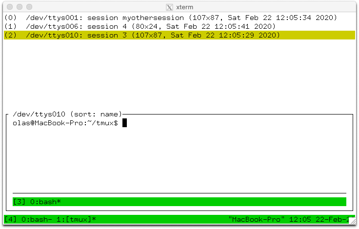

A list of clients is available by pressing `C-b D` (that is, `C-b S-d`). This
is similar to tree mode and is called client mode.

Each client is shown in the list in the top half with its name, attached
session, size and the time and date when it was last used; the bottom half has
a preview of the selected client with as much of its status line as will fit.

The movement and tag keys are the same as tree mode, but others are different,
for example the `Enter` key detaches the selected client.

This is a list of the keys in client mode without the movement and tagging keys
that are the same as tree mode:

Key|Function
---|---
`Enter`|Detach selected client
`d`|Detach selected client, same as `Enter`
`D`|Detach tagged clients
`x`|Detach selected client and try to kill the shell it was started from
`X`|Detach tagged clients and try to kill the shell they were started from

Other than using client mode, the `detach-client` flag has a `-a` flag to
detach all clients other than the attached client.

#### Killing a session, window or pane

Pressing `C-b &` prompts for confirmation then kills (closes) the current
window. All panes in the window are killed at the same time. `C-b x` kills only
the active pane. These are bound to the `kill-window` and `kill-pane` commands.

The `kill-session` command kills the attached session and all its windows and
detaches the client. There is no key binding for `kill-session` but it can be
used from the command prompt or the `:` prompt in tree mode.

#### Renaming sessions and windows

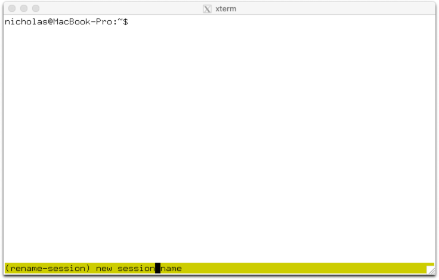

`C-b $` will prompt for a new name for the attached session. This uses the
`rename-session` command. Likewise, `C-b ,` prompts for a new name for the
current window, using the `rename-window` command.

#### Swapping and moving

tmux allows panes and windows to be swapped `swap-pane` and `swap-window`
commands.

To make swapping easy, a single pane can be marked. There is one marked pane
across all sessions. The `C-b m` key binding toggles whether the active pane in
the current window in the attached session is the marked pane. `C-b M` clears
the marked pane entirely. The marked pane is shown by a green background to its
border and the window containing the marked pane has an `M` flag in the status
line.

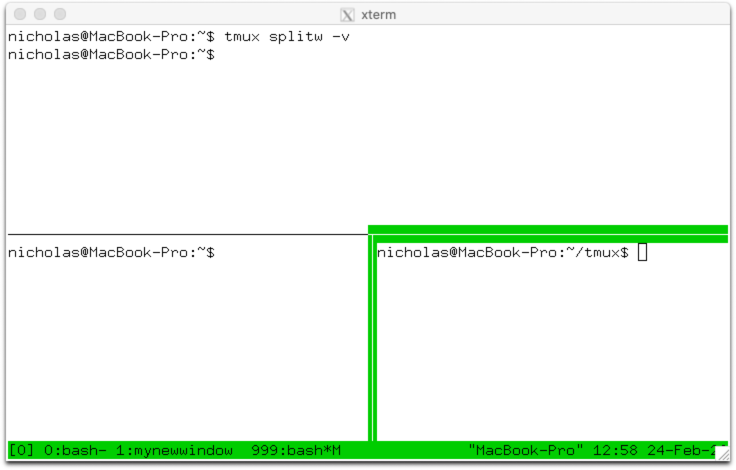

Once a pane is marked, it can be swapped with the active pane in the current
window with the `swap-pane` command, or the window containing the marked pane
can be swapped with the current window using the `swap-window` command. For
example, using the command prompt:

~~~~
:swap-pane
~~~~

Panes can additionally be swapped with the pane above or below using the `C-b
{` and `C-b }` key bindings.

Moving windows uses the `move-window` command or the `C-b .` key binding.
Pressing `C-b .` will prompt for a new index for the current window. If a
window already exists at the given index, an error will be shown. An existing
window can be replaced by using the `-k` flag - to move a window to index 999:

~~~~
:move-window -kt999
~~~~

If there are gaps in the window list, the indexes can be renumbered with the
`-r` flag to `move-window`. For example, this will change a window list of 0,
1, 3, 999 into 0, 1, 2, 3:

~~~~
:movew -r
~~~~

#### Resizing and zooming panes

Panes may be resized in small steps with `C-b C-Left', `C-b C-Right`, `C-b
C-Up` and `C-b C-Down` and in larger steps with `C-b M-Left', `C-b M-Right`,
`C-b M-Up` and `C-b M-Down`.

A single pane may be temporarily make to take up the full window with `C-b Z`;
pressing `C-b Z` again puts the window back where it was. This is called
zooming and unzooming. A window where a pane has been zoomed is marked with a
`Z` in the status line. Commands that change the size or position of panes in
the window automatically unzoom the window.

#### Window layouts

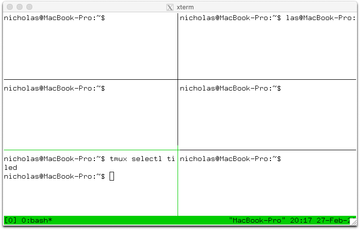

The panes in a window may be automatically arranged into one of several named
layouts, these may be rotated between with the `C-b Space` key binding or
chosen directly with `C-b M-1`, `C-b M-2` and so on.

The available layouts are:

Name|Key|Description
---|---|---
even-horizontal|`C-b M-1`|Spread out evenly across
even-vertical|`C-b M-2`|Spread out evenly up and down
main-horizontal|`C-b M-3`|One large pane at the top, the rest spread out evenly across
main-vertical|`C-b M-4`|One large pane on the left, the rest spread out evenly up and down
tiled|`C-b M-5`|Tiled in the same number of rows as columns

#### Copy and paste

tmux has its own copy and paste system. A piece of copied text is called a
paste buffer. Text is copied using copy mode, entered with `C-b [` and the most
recently copied text is pasted into the active pane with `C-b ]`.

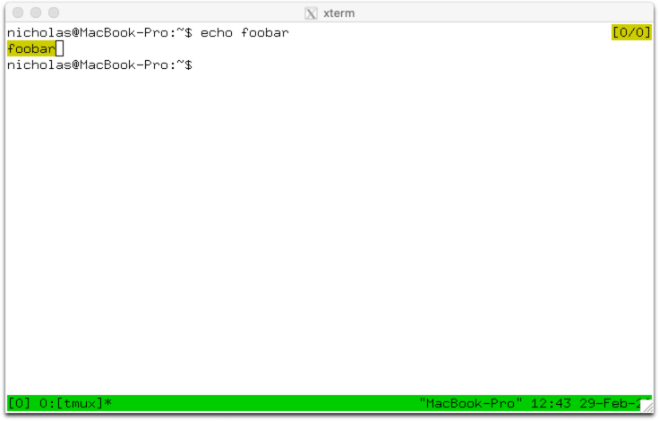

Paste buffers can be given names but by default they are assigned a name by
tmux, such as `buffer0` or `buffer1`. Buffers like this are called automatic
buffers and at most 50 are kept - once there are 50 buffers, the oldest is
removed when another is added. If a buffer is given a name, it is called a
named buffer; named buffers are not deleted no matter how many there are.

Copy mode freezes any output in a pane and allows text to be copied. View mode
(described earlier) is a read-only form of copy mode. The following keys are
some of those available in copy mode:

Key|Action
---|---
`Up`, `Down`, `Left`, `Right`|Move the cursor
`C-Space`|Start a selection
`C-w`|Copy the selection and exit copy mode
`q`|Exit copy mode
`C-g`|Stop selecting without copying, or stop searching
`C-a`|Move the cursor to the start of the line
`C-e`|Move the cursor to the end of the line
`C-r`|Search interactively backwards
`M-f`|Move the cursor to the next word
`M-b`|Move the cursor to the previous word

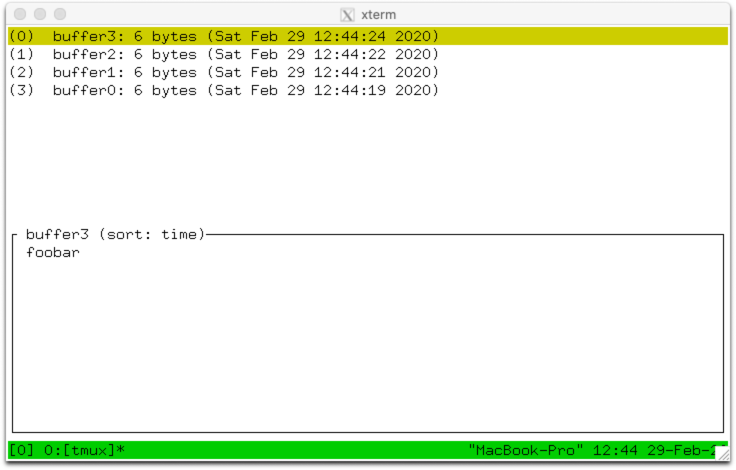

Once some text is copied, the most recent may be pasted with `C-b ]` or an
older one pasted by using buffer mode, entered with `C-b =`. Buffer mode is
similar to client mode and tree mode and offers a list of buffers together with
a preview of their contents. As well as the navigation and tagging keys used in
tree mode and client mode, buffer mode supports the following keys:

Key|Function
---|---
`Enter`|Paste selected buffer
`p`|Paste selected buffer, same as `Enter`
`P`|Paste tagged buffers
`d`|Delete selected buffer
`D`|Delete tagged buffers

A buffer may be renamed using the `set-buffer` command. The `-b` flag gives the
existing buffer name and `-n` the new name. This converts it into a named
buffer. For example, to rename `buffer0` to `mybuffer` from the command prompt:

~~~~
:setb -bbuffer0 -nmybuffer
~~~~

`set-buffer` can also be used to create buffers. To create a buffer called
`foo` with text `bar`:

~~~~
:setb -bfoo bar
~~~~

`load-buffer` will load a buffer from a file:

~~~~
:loadb -bbuffername ~/a/file
~~~~

`set-buffer` or `load-buffer` without `-b` creates an automatic buffer.

An existing buffer can be saved to a file with `save-buffer`:

~~~~
:saveb -bbuffer0 ~/saved_buffer
~~~~

#### Finding windows and panes

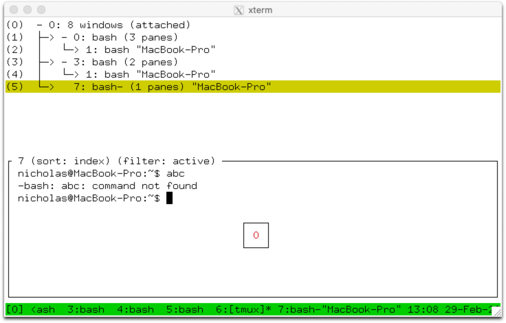

`C-b f` prompts for some text and then enters tree mode with a filter to show
only panes where that text appears in the visible content or title of the pane
or in the window name. If panes are found, only those panes appear in the tree,
and the text `filter: active` is shown above the preview. If no panes are
found, all panes are shown in the tree and the text `filter: no matches`
appears above the preview.

#### Using the mouse

tmux has rich support for the mouse. It can be used to change the active pane
or window, to resize panes, to copy text, or to choose items from menus.

Support for the mouse is enabled with the `mouse` option; options and the
configuration file are described in detail in the next section. To turn the
mouse on from the command prompt, use the `set-option` command:

~~~~
:set -g mouse on
~~~~

Once the mouse is enabled:

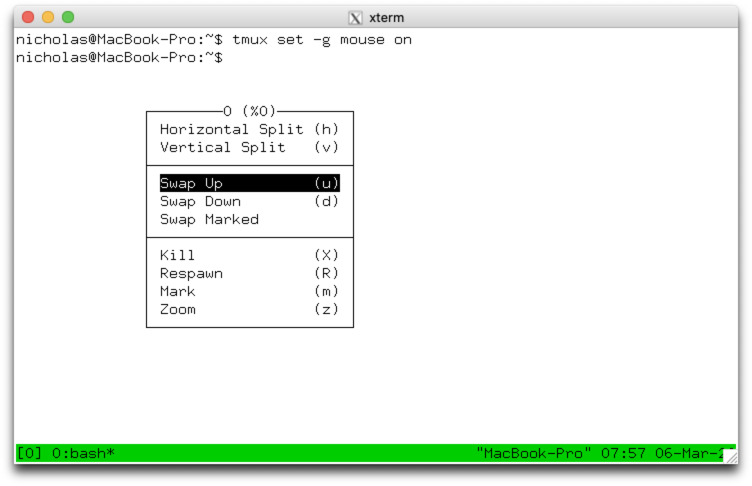

* Pressing the left button on a pane will make that pane the active pane.

* Pressing the left button on a window name on the status line will make that
  the current window.

* Dragging with the left button on a pane border resizes the pane.

* Dragging with the left button inside a pane selects text; the selected text
  is copied when the mouse is released.

* Pressing the right button on a pane opens a menu with various commands. When
  the mouse button is released, the selected command is run with the pane as
  target. Each menu item also has a key shortcut shown in brackets.

* Pressing the right button on a window or on the session name on the status
  line opens a similar menu for the window or session.

### Configuring tmux

#### The configuration file

When the tmux server is started, tmux runs a file called `.tmux.conf` in the
user's home directory. This file contains a list of tmux commands which are
executed in order. It is important to note that `.tmux.conf` is *only* run when
the server is started, not when a new session is created.

A different configuration file may be run from `.tmux.conf` or from a running
tmux server using the `source-file` command, for example to run `.tmux.conf`
again from a running server using the command prompt:

~~~~
:source ~/.tmux.conf
~~~~

Commands in a configuration file appear one per line. Any lines starting with
`#` are comments and are ignored:

~~~~
# This is a comment - turn status line off
set -g status off
~~~~

#### Key bindings

tmux key bindings are changed using the `bind-key` and `unbind-key` command.
Key bindings in tmux appear in key tables - there are two default key tables:

* The `root` table contains key bindings for keys pressed without the prefix key.

* The `prefix` table contains key bindings for keys pressed after the prefix
  key, like those mentioned so far in this document.

All the key bindings or those for a single table can be listed with the
`list-keys` command. By default, this shows the keys as a series of `bind-key`
commands. The `-T` flag gives the key table to show and the `-N` flag shows the
key help, like the `C-b ?` key binding.

For example to list only keys in the `prefix` table:

~~~~
$ tmux lsk -Tprefix
bind-key    -T prefix C-a     send-prefix
bind-key    -T prefix C-o     rotate-window
...
~~~~

Or:

~~~~
$ tmux lsk -Tprefix -N|head
C-o     Rotate through the panes
C-z     Suspend the current client
...
~~~~

`bind-key` commands can be used to set a key binding, either interactively or
most commonly from the configuration file. Like `list-keys`, it has a `-T` flag
for the key table to use. If `-T` is not given, the key is put in the `prefix`
table; the `-n` flag is a shorthand for `-Troot` to use the `root` table.

For example, the `list-keys` command shows that `C-b 9` changes to window 9
using the `select-window` command:

~~~~
$ tmux lsk -Tprefix 9
bind-key -T prefix 9 select-window -t :=9
~~~~

A similar key binding to make `C-b M-0` change to window 10 can be added like this:

~~~~
bind M-0 selectw -t:=10
~~~~

The `-t` flag to `select-window` specifies the target window. In this example,
the `:` means the target is a window and `=` means the name must match `10`
exactly. Targets are documented further in the [COMMANDS section of the manual
page](https://man.openbsd.org/tmux#COMMANDS).

The `unbind-key` command removes a key binding. Like `bind-key` it has `-T` and
`-n` flags for the key table. It is not necessary to remove a key binding
before binding it again, `bind-key` will replace any existing key binding.
`unbind-key` is necessary only to completely remove a key binding`:

~~~~
unbind M-0
~~~~

#### Types of option

XXX

#### Showing and changing options

XXX

#### Changing the prefix key

XXX

#### The status line

XXX

#### Alerts and monitoring

XXX

#### List of useful options

XXX

### Other key bindings

XXX

### Further information

XXX
