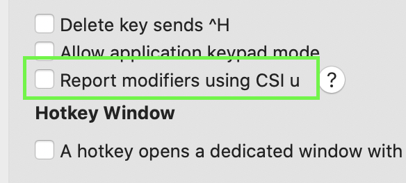

## Modifier keys

Terminals support three modifier keys: `Ctrl`, `Meta` (usually `Alt` on modern
keyboards) and `Shift`, but which keys support which modifiers and how they are
represented to tmux varies between terminals. This document gives an overview
of how these keys work and some help on how to troubleshoot them.

### What terminal keys look like

Keys are sent to tmux by terminals in three forms:

- Normal ASCII or UTF-8 keys are sent as themselves (`a` is `a`).

- `Ctrl` with ASCII keys are sent using the ASCII control characters (`C-a` is
  ASCII 1).

- `Meta` prefixes a key with a single ASCII `ESC` character (ASCII 27,
  sometimes written `^[`, `\033`, `\e` or `\E`). So `M-a` is `^[a`.

- Function keys are sent as a special sequence prefixed by ASCII `ESC`. The
  exact sequences for different keys varies.

It is important to note:

- The keys available to terminal applications like tmux are not necessarily the
  same as those available to the terminal itself, for example *X(7)* programs
  have a much larger range of keys available than can be passed to terminal
  applications.

- Terminal key sequences are not related to *X(7)* key symbols (used by
  *xmodmap(1)* or *xev(1)*) or those used by the Linux console.

### How tmux describes keys with modifiers

tmux describes keys with modifiers with one of three prefixes:

- `C-` for `Ctrl` keys;

- `M-` for `Meta` keys;

- `S-` for `Shift` keys.

These may be combined, so `Ctrl` and `Meta` and `Left` is `C-M-Left`.

Many keys with `Shift` have an alternative name, tmux uses this if it exists.
So there is no `S-a` - it is just in uppercase: `A`. Similarly, `S-Tab` is
`BTab`. The `S-` prefix is used for some function keys which have only one
form, for example `S-Left` and `S-Right`.

### Limitations of `Ctrl` keys

There are only 32 ASCII control characters, so in most terminals there are only
32 control keys:

- `C-@` is ASCII 0;

- `C-a` to `C-z` are ASCII 1 to ASCII 26;

- `C-[`, `C-\`, `C-]`, `C-^` and `C--` are ASCII 27 to 31.

Some of these are used for multiple keys, including:

- `C-@` is also `C-Space`;

- `C-[` is also `Escape`;

- `C-i` is also `Tab`;

- `C-m` is also `Enter`;

- `C--` is also `C-_`;

- `C-^` is also `C-/`.

This means that it is not possible to bind `C-@` and `C-Space` to different
things and on most terminals it is not possible to bind some keys like `C-!` or
`C-1` at all.

A few terminals have a feature that allows these keys to be used, see [this
section](Modifier-Keys#extended-keys).

### Limitations of `Shift` keys

Most ASCII keys have a `Shift` form marked on the keyboard which is sent when
the key is pressed with `Shift`. For example on a UK QWERTY keyboard, pressing
`S-1` will send `!`. tmux doesn't know the keyboard layout, so it treats `!` as
`!` not `S-1`. There is no to express the key `S-1` - `!` is used instead.

`Shift` modifiers and the `S-` prefix are mostly reserved for function keys
such as `S-F1` or `S-Left`.

### Limitations of UTF-8 keys

UTF-8 keys do not have a `Ctrl` or `Shift` form, so they will not work with
those modifiers. Because `Meta` works by sending a `^[` prefix, UTF-8
characters can work with a `Meta` modifier.

### The escape key

Because the `Escape` key is `^[` which is also the prefix used for `Meta` and
for function keys, tmux needs to work out whether a single `^[` is an `Escape`
key or part of a longer sequence. It does this using a timer:

- When the `^[` byte is seen, tmux starts the timer;

- If more data comes in before the timer runs out, tmux can work out whether
  the `^[` is part of a longer sequence;

- Or if the timer expires, the key is `Escape`.

This is why there can be a delay between pressing `Escape` and tmux passing the
key on to an application inside. The length of the timer is controlled by the
`escape-time` option, the default is 5000 milliseconds (half a second).

### Common function keys

The sequences that terminals send to tmux for function keys can vary, but for
common keys tmux can get the sequences from *terminfo(5)*.

This means that although they may differ between terminals, they usually work.
For example `Home` is in the `khom` capability which differs between tmux and
*xterm(1)*. The `tput` or `infocmp` commands can be used to inspect
*terminfo(5)* capabilities.

~~~~
$ tput -Ttmux khom|cat -v; echo
^[[1~
$ tput -Txterm khom|cat -v; echo
^[OH
~~~~

Because tmux can read `khom`, it can correctly recognize the sequences for this
key. In addition, tmux has builtin support for a few common sequences.

### Modifiers and function keys

Support for modifiers and function keys, such as `C-F1` or `C-S-Left`, is not
always present and these are often the keys that cause most trouble.

*xterm(1)* offers a descriptive sequence for these keys which many other
terminals also use, this includes a number in the key sequence for the
modifier, so `C-Left` is `^[[1;5D` where 5 means `Ctrl` and:

- 2 is `Shift`;
- 3 is `Meta`;
- 4 is `Shift` and `Meta`;
- 6 is `Shift` and `Ctrl`;
- 7 is `Meta` and `Ctrl`;
- 8 is `Shift` and `Meta` and `Ctrl`.

These forms are only used for function keys supported by modern terminals -
keys which were offered on traditional hardware terminals typically still use
their original sequences.

All tmux versions recognize this form of key, and tmux has sent it to
application running inside by default since tmux 2.4. In older versions, the
`xterm-keys` option must be enabled:

~~~~
set -g xterm-keys on
~~~~

### Extended keys

A few terminals have support for extended key sequences, this allows tmux to
recognise some keys that are not previously available, such as `C-1`.

tmux has support for this beginning with tmux 3.2.

For this to work, three things must be in place:

1) The terminal must support it: *xterm(1)*,
   [mintty](https://mintty.github.io/) and [iTerm2](https://www.iterm2.com/)
   currently support this.

2) tmux must recognise that the terminal supports it. tmux will automatically
   detect newer versions of these three terminals, but the `terminal-features`
   option can also be modified to enable it manually:

   ~~~~
   set -as terminal-features 'xterm*:extkeys'
   ~~~~

3) iTerm2 requires this option to be set in the profile: 

Once this feature is enabled, tmux will both recognise extended keys for its
own key bindings and forward them to applications inside. For example, running
*cat(1)* and pressing `C-1` will show:

~~~~
$ cat
^[[49;5u
~~~~

### Why a key might not work

In order for a key to work, two things must be true:

1) tmux and the terminal it is running in must agree on the sequence sent for
   the key; and

2) tmux and the application running inside must agree on the sequence sent for
   the key.

The sequence the terminal sends to tmux and the sequence tmux sends to the
application inside don't have to be the same - it is tmux's job to translate.
But if either tmux and the terminal or tmux and the application do not agree,
the key will not be recognized.

### Seeing what is sent for a key

The easiest way to see what is being sent for a key is to use *cat(1)* at the
shell prompt. For example, running *cat(1)* and pressing `C-Left` in tmux shows:

~~~~
$ cat
^[[1;5D
~~~~

What exactly is shown is usually not that important - the important things are:

- It must be unique - `C-Left` and `Left` must generate something different.

- It must be agreed by the application receiving it, so what is shown for
  `C-Left` by *cat(1)* outside tmux must match what tmux expects for `C-Left`.

### Troubleshooting steps

These are the best steps to follow to work out a problem with a key.

#### Check what is being sent to tmux

- Check what is being sent to tmux. Run *cat(1)* outside tmux and press the
  key, for example for `C-Left`:

  ~~~~
  $ cat
  ^[[1;5D
  ~~~~

- If this shows nothing, make sure the terminal or window manager is not using
  the key for its own purposes (for example, some terminals use `M-1` and `M-2`
  to switch tab).

- It does show something, make sure the output is different from other
  modifiers with the same key - is `C-Left` different from `S-Left` and `Left`?
  If not, the terminal does not support this combination of modifier and key
  and tmux will not be able to recognize it.

#### Try a tmux key binding

- Run tmux and create a binding for the key, for example:

  ~~~~
  $ tmux bind -n C-Left list-keys
  ~~~~

- Then press the key (`C-Left` in this case) and see if tmux shows the key
  list.

- If this doesn't work, then tmux doesn't understand the key sequence. Make
  sure that `TERM` is correct for the terminal tmux is running in:

  ~~~~
  $ echo $TERM
  ~~~~

  What this should show will depend on the terminal and should be in the
  terminal documentation.

- If `TERM` is correct and tmux does not recognize the key, it could be that
  the terminal is sending something unexpected, or it could be that
  *terminfo(5)* is missing the key. The best thing to do is to open an issue
  [here](https://github.com/tmux/tmux/issues) - make sure to mention both what
  *cat(1)* shows for the key outside tmux and what is in `TERM` outside tmux.

#### Check what tmux is sending to the application

- If tmux is recognizing a key for its own key bindings but the application
  inside is not, then check inside tmux using *cat(1)*. For example, tmux (like
  *xterm(1)*) sends `^[[1;5D` for `C-Left`:

  ~~~~
  $ cat
  ^[[1;5D
  ~~~~

- If tmux shows nothing, make sure there are no bindings in the root table for
  that key:

  ~~~~
  $ tmux lsk -Troot|grep 'C-Left'
  ~~~~

- With tmux version 2.3 or older, if tmux shows `^[[D` or `^[OD` instead, turn
  the `xterm-keys` option on (don't forget to restart tmux entirely with `tmux
  kill-server` after changing `.tmux.conf`):

  ~~~~
  set -g xterm-keys on
  ~~~~

- Below is a list of what tmux will send for particular keys if it is working
  correctly. Keys used with a modifier are listed with `_` instead of one of
  the numbers listed above (where 2 is `Shift`, 5 `Ctrl` and so on). If the
  output from *cat(1)* inside tmux does not match this table, open an issue
  [here](https://github.com/tmux/tmux/issues).

  Key|Sequence
  ---|---
  `F1`|`^[OP`
  `F2`|`^[OQ`
  `F3`|`^[OR`
  `F4`|`^[OS`
  `F5` to `F12`|`^[[15~` to `^[[24~`
  `Up`|`^[[A` or `^[OA`
  `Down`|`^[[B` or `^[OB`
  `Right`|`^[[C` or `^[OC`
  `Left`|`^[[D` or `^[OD`
  `Home`|`^[[1~`
  `End`|`^[[4~`
  `Insert`|`^[[2~`
  `Delete`|`^[[3~`
  `NPage` (`PageDown`)|`^[[6~`
  `PPage` (`PageUp`)|`^[[5~`
  `BTab`|`^[[Z`
  Modifier + `F1`|`^[[1;_P`
  Modifier + `F2`|`^[[1;_Q`
  Modifier + `F3`|`^[[1;_R`
  Modifier + `F4`|`^[[1;_S`
  Modifier + `F5` to `F12`|`^[[15;_~` to `^[[24;_~`
  Modifier + `Up`|`^[[1;_A`
  Modifier + `Down`|`^[[1;_B`
  Modifier + `Right`|`^[[1;_C`
  Modifier + `Left`|`^[[1;_D`
  Modifier + `Home`|`^[[1;_H`
  Modifier + `End`|`^[[1;_F`
  Modifier + `PPage`|`^[[5;_~`
  Modifier + `NPage`|`^[[6;_~`
  Modifier + `Insert`|`^[[2;_~`
  Modifier + `Delete`|`^[[3;_~`

#### Check the application itself

- If *cat(1)* inside tmux is showing what is expected, the problem must be the
application itself.

- If `TERM` is set to `screen` or `screen-256color` inside tmux, try using `tmux`
  or `tmux-256color` instead. Do this by changing the `default-terminal` option
  (don't forget to restart tmux entirely with `tmux kill-server` after changing
  `.tmux.conf`)

  ~~~~
  set -g default-terminal 'tmux-256color'
  ~~~~

- If this doesn't help, the application may need extra configuration to
  recognize the keys. This may be covered by the application documentation.

### The number keypad

In most terminals, the number keypad sends either numbers (`1`, `2` and so on)
or function keys (`Home`, `Up` and so on). With either of these, tmux cannot
tell that the keys are any different from the normal number keys or function
keys.

Some terminals additionally allow tmux to put the keypad into "application
mode", which allows it to recognize the keys separately so they can be used as
key bindings. To check if a terminal supports this, send the `smkx` capability
with *tput(1)* then look at the `1` key on the keypad with *cat(1)*:

~~~~
$ tput smkx
$ cat
^[Oq
~~~~

If this shows `^[Oq` then this mode is supported. If it shows something else,
it is not supported or the terminal needs additional configuration to enable
it.
